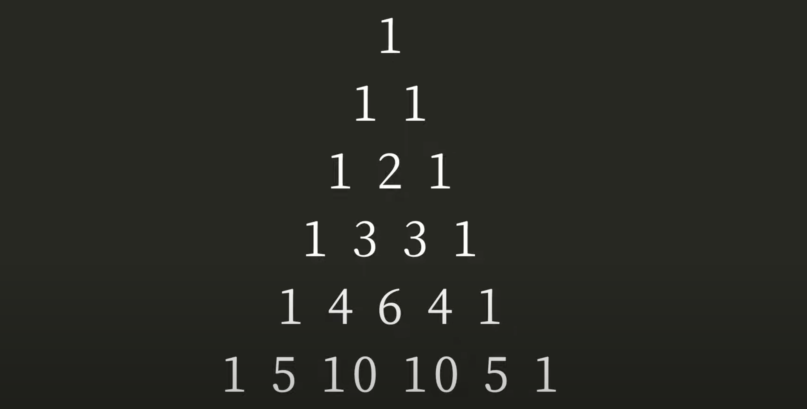

# 實作帕斯卡三角形 來理解 FP

##### 學習資料：[Functional Programming 入門篇：從帕斯卡三角形理解基礎](https://youtu.be/ZeqXAWx8CAc?feature=shared)

---

也是 leetCode 118 題，
給定一個整數，返回帕斯卡三角形的第一個 numRows。

- input: 5
- output: \[[1], [1, 1], [1, 2, 1], [1, 3, 3, 1], [1, 4, 6, 4, 1], [1, 5, 10, 10, 5, 1]]
  

---

一般寫法

```js
function generatePascalArr(numRows) {
  if (numRows === 0) return [];
  let result = [[1]];
  for (let i = 1; i < numRows; i++) {
    let lastRow = result[i - 1]; // 上一排
    let arr = [1]; //第一位一定為1
    for (let j = 1; j < i; j++) {
      // 上一排的數字 開始加總
      arr.push([lastRow[j - 1] + lastRow[j]]);
    }
    arr.push([1]); //最後一位一定為1
    result.push(arr);
  }
  return result;
}
```

簡化過後：

```js
// 列的值，這樣可以單獨印出單列的值
function nextRow(prevRow) {
  const row = [1];
  for (let i = 1; i < prevRow.length; i++) {
    row.push(prevRow[i - 1] + prevRow[i]);
  }
  row.push(1);
  return row;
}
// 迭代產出金字塔
function generatePascalArr(numRows) {
  let result = [];
  for (let i = 0; i < numRows; i++) {
    if (i === 0) {
      result.push([1]);
    } else {
      result.push(nextRow(result[i - 1]));
    }
  }
  return result;
}
```

---

### 為什麼用 for 回圈？

用宏觀的角度，他沒有改變外界的變數，所以算是符合 FP 的原則，但究竟要怎麼判斷要用多宏觀的視角來看？我們不用教條式的遵守原則，而是理解原則所帶來的好處，判斷用多 FP 來寫。
並不是所有的演算法 都可以直接轉變成 FP ，某些設計起來就很難使用 純宣告式 Declarative 的寫法。
