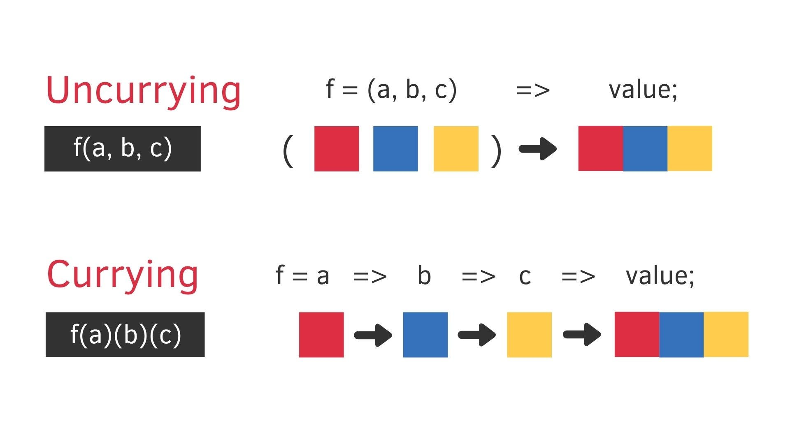

# Currying function

把接受多個參數的函數變換成接受一個單一參數就叫做 Currying。
（利用閉包，保留執行環境變量的特徵，讓 currying 得以執行。）


- 好處是：

  - DRY (Don’t Repeat Yourself): 不再一個函式處理所有事情，將程式碼依功能拆解成更小單元，有助於重複利用 (符合單一原則)
  - 參數複用

- 🌰：

  ```js
  function add(x, y, z) {
    return x + y + z;
  }
  add(1, 2, 3)

  改成 addCurrying(1)(2)(3);
  ```

## 實作

```js
function currying(fn) {
  const curryingFn = function (...args) {
    if (args.length === fn.length) {
      return fn.apply(this, ...args);
    } else {
      return function (...newArgs) {
        return curryingFn.apply(this, ...newArgs.concat(args));
      };
    }
  };
  return curryingFn;
}
```

## 練習

```js
/**
 * 讓 const add = (x, y) => x + y;
 * 變成 add(x)(y) 等同 add(x, y)
 **/

const add = (x, y) => x + y;
const curry = (f) => (x) => (y) => add(x, y);
```

```js
/**
 * 讓 const add = (x, y) => x + y;
 * 變成 add([x, y]) 等同 add(x, y)
 **/
const add = (x, y) => x + y;
const currying =
  (f) =>
  ([x, y]) =>
    f(x, y);
```

```js
/**
 * 讓 const add = (x, y) => x + y;
 * 變成 add(y, x) = add(x, y)
 **/
const add = (x, y) => x + y;
const currying = (f) => (x, y) => f(y, x);
```

```js
/**
 * 讓  ['a', 'b', 'c'].slice(0, 2)
 * 變成 slice(0)(2)(['a', 'b', 'c'])
 **/
const currying = (start) => (end) => (arr) => array.slice(start, end);
```
