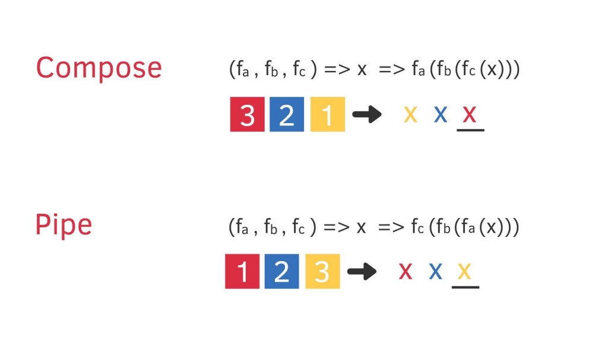

# Composition function

如果重複調用 A(B(C))，那是否可以將函數封裝成一個，再重複使用！
在 redux 的 middlewares 包裹 dispatch 也有使用到！

- 好處是：

  - 複用性高，可隨意組裝，新增功能
  - debug 方便

- pipe：pipe 是**反向**執行順序的 compose（reduce ＆ reduceRight）



- 🌰：

  ```js
  const compose = function (g, f) {
    return function (x) {
      return g(f(x));
    };
  };
  ```

## 實作

```js
/**
 * 使用方式會是
 * 原先 Afn(Bfn(Cfn(123)))
 * const composeFn = compose(Afn, Bfn, Cfn)
 * composeFn(123)
 *  */
function compose(...fns) {
  return (args) => fns.reduceRight((v, f) => f(v), args);
}

// 變成箭頭函式
const compose =
  (...fns) =>
  (args) =>
    fns.reduceRight((v, f) => f(v), args);

// 不用reduce寫的話
function compose(...funcs) {
  return (args) => {
    let result = args;
    for (let i = funcs.length - 1; i > 0; i--) {
      result = funcs[i](result);
    }
    return result;
  };
}

const pipe =
  (...fns) =>
  (args) =>
    fns.reduceRight((v, f) => f(v), args);
```

## Pointfree

放入組合函式中的函式們，不用關心實際數據裡面有什麼，只要做好自己的小功能就好。

- 🌰：

  ```js
  // 非 pointfree，因為我們提到資料：word
  var snakeCase = function (word) {
    return word.toLowerCase().replace(/\s+/gi, "_");
  };

  // pointfree，有點像是工廠裡面的機器，只要知道送來的東西是可處理的
  var snakeCase = compose(replace(/\s+/gi, "_"), toLowerCase);
  ```

## DeBug

雖然組合函式很方便，但假設 args 參數不一致，組合的函式中有一個僅接受單一參數或是型別不一怎麼辦？

```js
const R = require("ramda");
const data = ["frog", "eyes"];

let exclaim = (x) => x + "!";
let toUpperCase = (x) => x.toUpperCase();

// 將參數限定在“字串”的函式 組合
let angry = compose(exclaim, toUpperCase);
// 組了參數限定在“陣列”的函式
const latin = compose(angry, map);
latin(data); // ❌

// R.map 回傳一個 fn 接受一個 arr 作為參數，內部迭代 調用 angry 方法
const latin = compose(R.map(angry), reverse);
latin(data); //[ 'EYES!', 'FROG!' ]
```

## Trace

在組合函式執行的過程中，會不好找出錯誤！有沒有可能，組合的中間安插一個可以 `console.log` 的函式，看是在執行到哪個函式出錯的？

```js
function trace(tipText) {
  return function (args) {
    console.log("tipText:", args);
    return args;
  };
}
----> 是不是等於前一章用到的 currying
----> 把參數拆開來，回傳一個新函式

const trace = curry(function(tipText, args) {
  console.log("tipText", args);
  return x;
});

const latin = compose(
                angry,
                trace('after reverse data :'),
                reverse
              );

latin(data)
```
